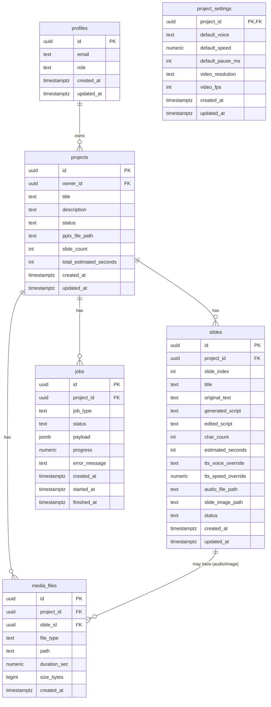

# 研修動画自動生成ツール - 詳細設計書

このドキュメントは、研修動画自動生成ツールの技術スタック、データベース設計、API設計を定義します。

---

## 目次

1. [使用技術スタックの提案](#1-使用技術スタックの提案)
2. [データベース設計（ER図）](#2-データベース設計er図)
3. [API設計](#3-api設計)

---

# 1. 使用技術スタックの提案

## 1.1 全体アーキテクチャ方針

* **フロントエンド & API**：
  * Next.js（App Router）＋ TypeScript
  * Vercel にデプロイ（サーバレス関数でAPI実装）

* **データベース & 認証 & ストレージ**：
  * Supabase（PostgreSQL／Auth／Storage）

* **メディア処理（PPTX解析・ffmpeg）**：
  * Node.js ベースの「メディア処理ワーカー」（別ホスティングでもOK）
    * 例：Render / Fly.io / Supabase Edge Functions など
    * MVP段階では「1つの小さなNodeコンテナ」で十分

### 採用理由（要点）

* **Vercel ＋ Next.js**
  * SSR/CSR/Static が柔軟に選べる
  * デプロイ・環境変数・ロールバックなど管理が楽
  * サーバレス関数で簡単に API を増やせる

* **Supabase**
  * Postgres＋Auth＋Storage が一体で、構成がシンプル
  * フロントから Supabase クライアントで直接クエリ可能（管理系はAPI経由）
  * 無料〜低価格で MVP を回しやすい

* **メディア処理ワーカーを別プロセスに分離**
  * PPTX解析と ffmpeg は Vercel Functions の制限（実行時間・バイナリ）と相性が悪い
  * ワーカーを独立させることで、**Vercel は軽いAPI＋画面**, 重い処理はワーカーに集約

---

## 1.2 フロントエンド

* フレームワーク：Next.js 14（App Router）
* 言語：TypeScript
* UI：
  * Tailwind CSS
  * コンポーネントライブラリ：shadcn/ui（必要に応じて）
* 状態管理・通信：
  * TanStack Query（React Query）で API / Supabase との通信を統一
  * Supabase JS クライアント（認証と一部のデータ取得）
* 認証：
  * Supabase Auth（メール＋パスワード）
  * フロントでログイン → アクセストークンを取得 → API呼び出し時に `Authorization: Bearer <token>` を付与

---

## 1.3 バックエンド/API（Vercel Functions）

* ランタイム：Node.js + TypeScript（Next.js Route Handlers）
* 役割：
  * プロジェクト・スライドデータの CRUD
  * メディア処理ジョブの登録・状態確認
  * Supabase Storage の署名付きURL生成（動画・音声ダウンロード用）
  * 管理者向けダッシュボード用集計 API

---

## 1.4 メディア処理ワーカー

* ランタイム：Node.js（または Python でもOKだが、今回は Node.js で揃える想定）
* ライブラリ例：
  * PPTX解析：`pptxgenjs`、`officeparser`、`unoconv` 経由など（詳細は実装時に選定）
  * 動画合成：`ffmpeg`（`fluent-ffmpeg` ラッパーなど）
* 接続先：
  * Supabase Storage から PPTX ファイルを取得
  * Supabase Storage にスライド画像・音声・動画を書き込み
  * Supabase DB の `jobs` / `projects` / `slides` を更新
* ジョブ駆動：
  * バックエンド API から「ジョブレコード」をINSERT（例：`job_type = 'pptx_parse'`）
  * ワーカーが一定間隔で `jobs` テーブルをポーリングして処理

---

## 1.5 TTS / 動画生成

### TTS（音声合成）

* 前提：**ランニングコスト低め、プロバイダは抽象化**
* 抽象インターフェース：
  * `POST /tts`（内部用）
    * 入力：テキスト、声種、話速、音量など
    * 出力：音声バイナリ or ストレージへのパス
* 実装候補：
  * Google Cloud Text-to-Speech
  * OpenAI TTS
* アプリ側は「TTSプロバイダの選定を環境変数で切り替え」できるように設計

### 動画生成

* ffmpeg による **静的スライド画像＋音声の結合**
  * 解像度：例）1280x720（HD）
  * フレームレート：30fps
  * 各スライドごとに「開始時間・終了時間」を指定し、音声長に合わせて表示
* コスト削減のため：
  * 凝ったトランジションは入れず、**フェード程度のシンプルな構成**
  * 再生成時は音声だけ or 全体動画を再生成などオプションを分ける

---

# 2. データベース設計（ER図）

## 2.1 テーブル一覧（概要）

1. `users`
   * Supabase Auth のユーザーIDを利用（アプリ側は参照）

2. `profiles`
   * アプリ内ユーザー情報（ロール：トレーナー／管理者など）

3. `projects`
   * 研修プロジェクト（PPTX単位）

4. `project_settings`
   * プロジェクトごとのデフォルト音声設定など

5. `slides`
   * 1スライドごとのテキスト・原稿・TTS設定・状態

6. `jobs`
   * PPTX解析／音声生成／動画生成などの非同期処理ジョブ

7. `media_files`
   * PPTXファイル、スライド画像、音声、動画のパス管理

---

## 2.2 各テーブル詳細

### 2.2.1 `profiles`

| カラム名       | 型           | 備考                        |
| ---------- | ----------- | ------------------------- |
| id         | uuid (PK)   | `auth.users.id` と同一       |
| email      | text        | 表示用／検索用（Supabase Authと同期） |
| role       | text        | `trainer` / `admin`       |
| created_at | timestamptz |                           |
| updated_at | timestamptz |                           |

---

### 2.2.2 `projects`

| カラム名                    | 型           | 備考                                                                             |
| ----------------------- | ----------- | ------------------------------------------------------------------------------ |
| id                      | uuid (PK)   |                                                                                |
| owner_id                | uuid (FK)   | `profiles.id`                                                                  |
| title                   | text        | 研修タイトル                                                                         |
| description             | text        | 説明                                                                             |
| status                  | text        | `draft` / `editing` / `audio_generating` / `video_generating` / `completed` など |
| pptx_file_path          | text        | Supabase Storage 上のパス                                                          |
| slide_count             | integer     | スライド枚数                                                                         |
| total_estimated_seconds | integer     | 推定合計時間（秒）                                                                      |
| created_at              | timestamptz |                                                                                |
| updated_at              | timestamptz |                                                                                |

---

### 2.2.3 `project_settings`

| カラム名             | 型            | 備考                          |
| ---------------- | ------------ | --------------------------- |
| project_id       | uuid (PK,FK) | `projects.id`               |
| default_voice    | text         | `female_bright` など TTSの声種キー |
| default_speed    | numeric      | 1.0 = 標準、0.8〜1.2            |
| default_pause_ms | integer      | スライド間ポーズ(ms)                |
| video_resolution | text         | `1280x720` など               |
| video_fps        | integer      | 例：30                        |
| created_at       | timestamptz  |                             |
| updated_at       | timestamptz  |                             |

---

### 2.2.4 `slides`

| カラム名               | 型           | 備考                                      |
| ------------------ | ----------- | --------------------------------------- |
| id                 | uuid (PK)   |                                         |
| project_id         | uuid (FK)   | `projects.id`                           |
| slide_index        | integer     | 1,2,3,...（PPTX内での順番）                    |
| title              | text        | スライドタイトル                                |
| original_text      | text        | PPTXから抽出した元のテキスト                        |
| generated_script   | text        | 自動生成されたナレーション案                          |
| edited_script      | text        | トレーナーが編集した確定原稿                          |
| char_count         | integer     | `edited_script` の文字数                    |
| estimated_seconds  | integer     | 読み上げ時間の推定（35〜40秒の判定に使用）                 |
| tts_voice_override | text        | スライド単位の声種（未設定ならNULLでデフォルト）              |
| tts_speed_override | numeric     | スライド単位の話速（NULLでデフォルト）                   |
| audio_file_path    | text        | スライドごとの音声ファイルパス                         |
| slide_image_path   | text        | スライド画像パス（PPTXからレンダリングしたもの）              |
| status             | text        | `draft` / `tts_pending` / `tts_done` など |
| created_at         | timestamptz |                                         |
| updated_at         | timestamptz |                                         |

---

### 2.2.5 `jobs`

| カラム名          | 型           | 備考                                                   |
| ------------- | ----------- | ---------------------------------------------------- |
| id            | uuid (PK)   |                                                      |
| project_id    | uuid (FK)   |                                                      |
| job_type      | text        | `pptx_parse` / `tts_generation` / `video_generation` |
| status        | text        | `pending` / `running` / `success` / `failed`         |
| payload       | jsonb       | 対象スライド範囲、再生成フラグなど                                    |
| progress      | numeric     | 0〜100                                                |
| error_message | text        | 失敗時メッセージ                                             |
| created_at    | timestamptz |                                                      |
| started_at    | timestamptz |                                                      |
| finished_at   | timestamptz |                                                      |

---

### 2.2.6 `media_files`

| カラム名         | 型           | 備考                                         |
| ------------ | ----------- | ------------------------------------------ |
| id           | uuid (PK)   |                                            |
| project_id   | uuid (FK)   |                                            |
| slide_id     | uuid (FK)   | スライドに紐づかない場合はNULL                          |
| file_type    | text        | `pptx` / `slide_image` / `audio` / `video` |
| path         | text        | Supabase Storage パス                        |
| duration_sec | numeric     | 音声・動画の場合のみ                                 |
| size_bytes   | bigint      |                                            |
| created_at   | timestamptz |                                            |

※ `media_files` を使わず、`projects` / `slides` の `*_file_path` に寄せてもOKですが、将来の拡張性を考え定義しています。

---

## 2.3 ER図（Mermaid）



---

# 3. API設計

## 3.1 認証・共通仕様

* 認証：
  * Supabase Auth による JWT
  * フロント → API へ `Authorization: Bearer <access_token>` を付与
* ベースURL：
  * `/api/*`（Next.js Route Handlers）
* レスポンスフォーマット：
  * `application/json`
  * 成功時：`{ data: ..., error: null }`
  * エラー時：`{ data: null, error: { code, message } }`

---

## 3.2 エンドポイント一覧（主要）

### 3.2.1 認証・プロフィール

（ログイン自体は Supabase に委譲するため、アプリ側はプロファイル参照のみ）

| メソッド | パス        | 説明                |
| ---- | --------- | ----------------- |
| GET  | `/api/me` | ログインユーザーのプロフィール取得 |

---

### 3.2.2 プロジェクト

| メソッド  | パス                                         | 説明                        |
| ----- | ------------------------------------------ | ------------------------- |
| GET   | `/api/projects`                            | 自分のプロジェクト一覧（TR-02用）       |
| POST  | `/api/projects`                            | 新規プロジェクト作成（タイトル・説明）       |
| GET   | `/api/projects/:projectId`                 | プロジェクト詳細（TR-03用）          |
| PATCH | `/api/projects/:projectId`                 | タイトル・説明・ステータスなど更新（TR-09用） |
| POST  | `/api/projects/:projectId/pptx/upload-url` | PPTXアップロード用の署名付きURLを発行    |
| POST  | `/api/projects/:projectId/parse`           | PPTX解析ジョブを起動（TR-04後の処理）   |

---

### 3.2.3 スライド・原稿

| メソッド  | パス                                            | 説明                           |
| ----- | --------------------------------------------- | ---------------------------- |
| GET   | `/api/projects/:projectId/slides`             | 対象プロジェクトのスライド一覧（TR-05用）      |
| GET   | `/api/projects/:projectId/slides/:slideId`    | スライド詳細取得                     |
| PATCH | `/api/projects/:projectId/slides/:slideId`    | `edited_script` や TTS個別設定の更新 |
| POST  | `/api/projects/:projectId/slides/recalc-time` | 全スライドの文字数／推定時間を再計算           |

---

### 3.2.4 音声設定・生成

| メソッド  | パス                                        | 説明                         |
| ----- | ----------------------------------------- | -------------------------- |
| GET   | `/api/projects/:projectId/audio-settings` | プロジェクトのデフォルト音声設定取得（TR-06用） |
| PATCH | `/api/projects/:projectId/audio-settings` | デフォルト音声設定更新                |
| POST  | `/api/projects/:projectId/audio/generate` | 音声生成ジョブ起動（全スライド or 一部）     |

`/audio/generate` の `payload` で「対象スライドID配列」「再生成フラグ」などを指定。

---

### 3.2.5 動画生成・ステータス

| メソッド | パス                                            | 説明                           |
| ---- | --------------------------------------------- | ---------------------------- |
| POST | `/api/projects/:projectId/video/generate`     | 動画生成ジョブ起動（TR-06 → TR-07）     |
| GET  | `/api/projects/:projectId/video`              | 完成動画の情報取得（パス・長さなど）           |
| GET  | `/api/projects/:projectId/video/download-url` | 動画の署名付きURL取得（TR-08 Download） |

---

### 3.2.6 ジョブ管理

| メソッド | パス                              | 説明                    |
| ---- | ------------------------------- | --------------------- |
| GET  | `/api/projects/:projectId/jobs` | プロジェクト内のジョブ一覧（TR-07用） |
| GET  | `/api/jobs/:jobId`              | 個別ジョブの詳細ステータス取得       |

---

### 3.2.7 管理者用

| メソッド  | パス                         | 説明               |
| ----- | -------------------------- | ---------------- |
| GET   | `/api/admin/dashboard`     | 利用状況サマリ（AD-01）   |
| GET   | `/api/admin/users`         | ユーザー一覧（AD-02）    |
| PATCH | `/api/admin/users/:userId` | 権限・有効／無効の更新      |
| GET   | `/api/admin/logs`          | エラー・ジョブログ（AD-04） |

---

## 3.3 代表API 詳細例

### 3.3.1 新規プロジェクト作成（`POST /api/projects`）

**Request**

```json
{
  "title": "コンプライアンス研修2025",
  "description": "新入社員向けコンプライアンス基礎研修"
}
```

**Response**

```json
{
  "data": {
    "id": "uuid-project-1",
    "title": "コンプライアンス研修2025",
    "description": "新入社員向けコンプライアンス基礎研修",
    "status": "draft",
    "pptx_file_path": null,
    "slide_count": 0,
    "created_at": "2025-11-14T09:00:00Z"
  },
  "error": null
}
```

---

### 3.3.2 PPTX アップロード用URL取得（`POST /api/projects/:projectId/pptx/upload-url`）

**Request**

```json
{
  "fileName": "compliance_2025.pptx"
}
```

**Response**

```json
{
  "data": {
    "uploadUrl": "https://...supabase.co/storage/v1/object/sign/...",
    "objectPath": "projects/uuid-project-1/source/compliance_2025.pptx"
  },
  "error": null
}
```

フロントは `uploadUrl` に `PUT` してアップロード → 完了後、`objectPath` を `projects.pptx_file_path` に保存。

---

### 3.3.3 PPTX解析ジョブ起動（`POST /api/projects/:projectId/parse`）

**Request**

```json
{
  "reparse": false
}
```

**Response**

```json
{
  "data": {
    "jobId": "uuid-job-parse-1"
  },
  "error": null
}
```

ワーカーは `jobs` テーブルを見てPPTXを解析 → `slides` レコードを作成。

---

### 3.3.4 スライド原稿更新（`PATCH /api/projects/:projectId/slides/:slideId`）

**Request**

```json
{
  "edited_script": "本スライドでは本研修の目的とゴールについて説明します。",
  "tts_voice_override": "female_calm",
  "tts_speed_override": 0.95
}
```

**Response**

```json
{
  "data": {
    "id": "uuid-slide-3",
    "edited_script": "本スライドでは本研修の目的とゴールについて説明します。",
    "tts_voice_override": "female_calm",
    "tts_speed_override": 0.95,
    "estimated_seconds": 37
  },
  "error": null
}
```

---

### 3.3.5 動画生成ジョブ起動（`POST /api/projects/:projectId/video/generate`）

**Request**

```json
{
  "regenerate": false
}
```

**Response**

```json
{
  "data": {
    "jobId": "uuid-job-video-1"
  },
  "error": null
}
```

TR-07 では `/api/jobs/:jobId` or `/api/projects/:id/jobs` をポーリングし、「音声生成中」「動画合成中」「完了」を表示。

---

## 実装フェーズ

### Phase 1: プロジェクト基盤（優先度：高）
- Next.js + TypeScript プロジェクトのセットアップ
- Supabase の設定とデータベーススキーマの作成
- 基本的な認証フロー（Supabase Auth）
- プロジェクト一覧・作成・詳細のAPI実装

### Phase 2: PPTX処理とスライド管理（優先度：高）
- PPTX アップロード機能
- メディア処理ワーカーの基本実装
- PPTX 解析処理（テキスト抽出）
- スライド一覧表示と原稿編集機能

### Phase 3: TTS統合と音声生成（優先度：中）
- TTS プロバイダの抽象化レイヤー実装
- 音声生成ジョブの実装
- プロジェクト/スライド単位の音声設定管理
- 音声プレビュー機能

### Phase 4: 動画生成（優先度：中）
- ffmpeg を使った動画合成処理
- 動画生成ジョブの実装
- 動画ダウンロード機能
- 進捗表示の実装

### Phase 5: 管理機能と最適化（優先度：低）
- 管理者ダッシュボード
- ユーザー管理機能
- ログ・監視機能
- パフォーマンス最適化

---

## 開発環境のセットアップ

### 必要な環境変数

```env
# Supabase
NEXT_PUBLIC_SUPABASE_URL=
NEXT_PUBLIC_SUPABASE_ANON_KEY=
SUPABASE_SERVICE_ROLE_KEY=

# TTS Provider (選択可能)
TTS_PROVIDER=openai # or google
OPENAI_API_KEY=
GOOGLE_CLOUD_PROJECT_ID=
GOOGLE_APPLICATION_CREDENTIALS=

# Worker
WORKER_ENDPOINT=
WORKER_SECRET_KEY=
```

### ディレクトリ構造

```
training-maker/
├── src/
│   ├── app/              # Next.js App Router
│   │   ├── api/          # API Routes
│   │   ├── (auth)/       # 認証関連ページ
│   │   ├── (dashboard)/  # ダッシュボード
│   │   └── layout.tsx
│   ├── components/       # React コンポーネント
│   ├── lib/              # ユーティリティ・ヘルパー
│   │   ├── supabase/     # Supabase クライアント
│   │   ├── tts/          # TTS抽象化レイヤー
│   │   └── types/        # TypeScript 型定義
│   └── middleware.ts     # Next.js ミドルウェア
├── worker/               # メディア処理ワーカー
│   ├── src/
│   │   ├── jobs/         # ジョブハンドラー
│   │   ├── services/     # PPTX, ffmpeg など
│   │   └── index.ts
│   └── Dockerfile
├── supabase/
│   ├── migrations/       # DB マイグレーション
│   └── seed.sql          # 初期データ
└── docs/                 # ドキュメント
```
